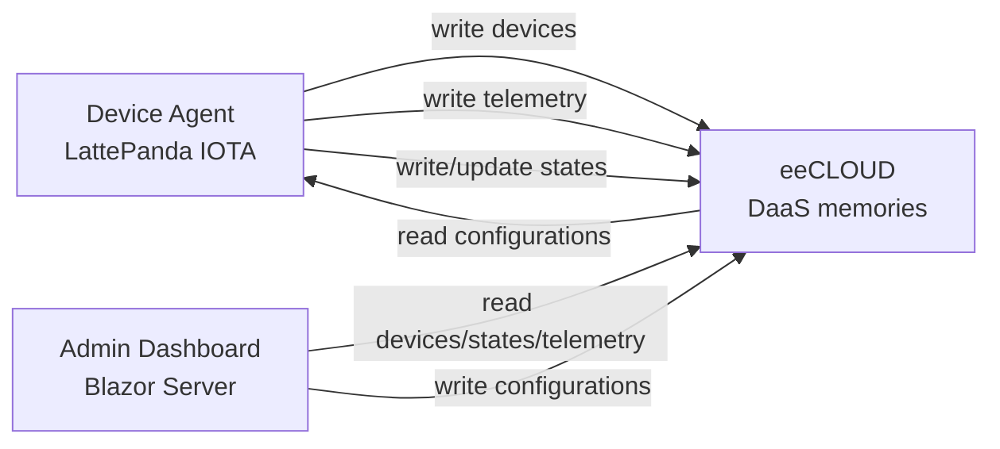

# LattePanda IOTA + eeCLOUD - IoT DaaS Demo

A small, developer-oriented demo showing how an IoT project can use
**eeCLOUD as a Data-as-a-Service backend** instead of building custom IT
infrastructure.

The point of this repository is simple: an embedded or hardware developer should
be able to focus on the device, sensors, firmware, local logic, and field
behavior, while eeCLOUD provides the API-based data layer for telemetry,
configuration, and state.

This is intentionally a **minimal reference pattern**, not a full production
platform.

The demo uses a common **edge/gateway** flow on **LattePanda IOTA**:

- A **Device Agent (.NET)** runs on the LattePanda and continuously publishes **telemetry** and **reported state** to **eeCLOUD**.
- An **Admin Dashboard (Blazor Server)** publishes **remote configuration** (per device or per group).
- The Device Agent automatically fetches and applies new config versions, then reports the **AppliedConfigVersion** back.

This repo is intended to be simple to run, easy to read, and easy to extend.
Teams can reuse the ideas shown here and then build their own more structured
solutions around them.

---

## What this demo proves

With eeCLOUD, this IoT flow does **not** require a custom backend service,
database schema, REST API, migrations, or storage layer just to get started.

The device and dashboard both talk to eeCLOUD through APIs:

- the **device** writes telemetry and state;
- the **dashboard** reads devices, state, and telemetry;
- the **dashboard** publishes desired configuration;
- the **device** reads configuration and confirms what it applied.

eeCLOUD acts as the shared data layer between edge and cloud-facing tools.

---

## Architecture

**3 components**

1. **LattePanda IOTA - Device Agent (.NET Worker / Console)**
   - Registers a device identity (deviceId, group, name)
   - Reads latest *desired config* (device override -> group fallback)
   - Applies config live (e.g., `samplingMs`, `logLevel`, feature flags)
   - Writes telemetry + reported state (including applied config version)

2. **eeCLOUD (DB + API / Data layer)**
   - Stores device records, desired config versions, telemetry, and reported state
   - Provides memory-based read/write APIs
   - Does not require a schema to be created upfront

3. **Admin Dashboard (Blazor Server)**
   - Lists devices and latest reported state
   - Publishes new desired config versions
   - Displays telemetry with a lightweight **SVG chart** (no external charting libs)

---

## Demo flow (what to record / show)

1. Run the **Device Agent** and let it register `LP-001`.
2. Open **Devices** and confirm that the device appears with latest reported state.
3. Open **Telemetry** -> select `LP-001` -> press **Load** -> show live chart updates.
4. Go to **Publish Config** -> set target (`device` or `group`) -> change `samplingMs` (e.g., 1000 -> 250) -> increment `version` -> **Publish**.
5. Return to **Telemetry** -> see updates arrive more frequently.
6. Open **Device Details** and confirm the new `AppliedConfigVersion`.

---

## Prerequisites

- .NET 10 SDK
- An eeCLOUD account + **Application** + **API key**, visit: https://eecloud.io
- LattePanda IOTA running Windows or Linux (or any x86 machine for local testing)

---

## Repo layout

```
Shared/		Shared models + helpers
Agent/		Runs on the device (LattePanda IOTA)
Admin/		Blazor Server admin dashboard
```

---

## Configuration (recommended)

Do **not** commit real secrets to GitHub.

Use **User Secrets** for local development (recommended), or environment variables for production.

### Admin (Blazor Server)

From `Admin`:

```bash
dotnet user-secrets init
dotnet user-secrets set "eeCLOUD:ApiKey" "YOUR_API_KEY"
```

### Device Agent

From `Agent`:

```bash
dotnet user-secrets init
dotnet user-secrets set "eeCLOUD:ApiKey" "YOUR_API_KEY"

# Device identity (example)
dotnet user-secrets set "Device:DeviceId" "LP-001"
dotnet user-secrets set "Device:Group" "lab"
dotnet user-secrets set "Device:Name" "LattePanda IOTA - Demo"
```

> If you prefer `appsettings.json`, keep `ApiKey` empty in committed files and use `appsettings.Development.json` locally (gitignored).

---

## Run the demo

### 1) Run the Admin Dashboard

```bash
cd Admin
dotnet run
```

Open the URL printed in the console (typically `https://localhost:xxxx`).

### 2) Run the Device Agent

```bash
cd Agent
dotnet run
```

You should start seeing telemetry and reported state in the Admin UI.

---

## Data model (memories / collections)

The demo uses a simple data model, typically mapped to eeCLOUD "memories/collections":

- **devices**: `deviceId`, `group`, `name`, `metadata`, `createdAtUtc`
- **configurations**: `targetType` (`device|group`), `targetId`, `version`, `config`, `publishedAtUtc`
- **states**: `deviceId`, `lastSeenUtc`, `appliedConfigVersion`, `runtime`
- **telemetry**: `deviceId`, `timestampUtc`, `metrics`

### Memory map

| Memory | Written by | Read by | Index used in this demo |
|---|---|---|---|
| `devices` | Device Agent | Admin Dashboard | `deviceId` |
| `configurations` | Admin Dashboard | Device Agent | `deviceId` for device config, `group` for group fallback |
| `states` | Device Agent | Admin Dashboard | `deviceId` |
| `telemetry` | Device Agent | Admin Dashboard | `deviceId` |

The important concept is that eeCLOUD memories behave like logical data areas.
The application code chooses memory names and indexes, then reads and writes
data through the SDK.

---

## Configuration flow

Configuration is versioned and intentionally simple:

1. The Admin publishes a `DesiredConfig` to the `configurations` memory.
2. The Agent first looks for a device-specific config using its `deviceId`.
3. If no device-specific config exists, the Agent falls back to its `group`.
4. The Agent applies the config only when `Version` is greater than the local `AppliedConfigVersion`.
5. The Agent reports the applied version back through the `states` memory.

This gives the dashboard a clear confirmation path: publishing config is not the
same thing as applying config; the device confirms application through reported
state.

---

## Data flow



---

## Telemetry chart (SVG)

Telemetry is displayed using a minimal **SVG line chart** (no JS, no chart libraries).
Hover points to see tooltips (timestamp + value).

---

## Notes & tips

- **Versioning**: Always increment `version` when publishing new desired configs.
- **Device override vs group**: The agent can check device-specific config first, then fall back to the group.
- **Latency metric**: You can measure write latency with `Stopwatch` and publish it (e.g., `netDelay` / `writeMs`) as telemetry.
- **Production projects**: This demo keeps the code compact on purpose. Real deployments may add authentication hardening, retries/backoff policies, audit logs, provisioning workflows, richer dashboards, and device lifecycle management.

---

## Roadmap ideas (future improvements)

- Time range queries: `from/to` timestamp filters
- Downsampling / aggregation for long ranges
- Rollback to previous config versions
- Audit log of config changes
- Device groups & tags
- Auth hardening / key rotation guidance

---

## Security note

Do not commit your eeCLOUD API key to GitHub.

Use:
- .NET User Secrets (recommended)
- Environment variables

If a key is exposed, revoke it immediately and generate a new one.

---

## License

MIT

---

## Contact

Nextsys / eeCLOUD  
Demo author: Giovanni Petruzzellis
